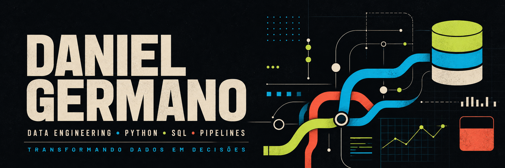
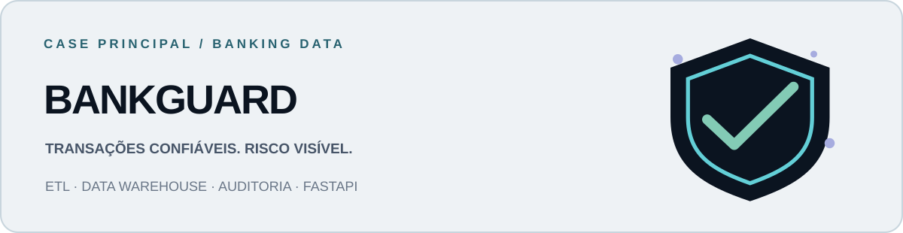
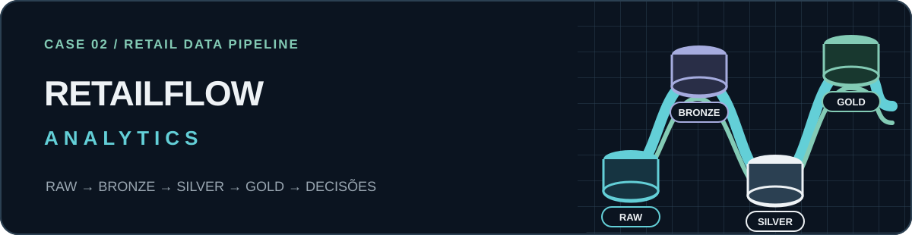
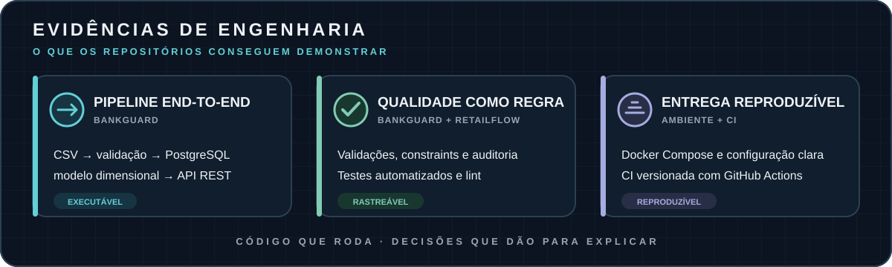

  

  

  
  
  

## Sobre mim

Eu gosto da parte do trabalho que quase ninguém vê quando ela funciona: o dado chegando limpo, a regra registrada, o pipeline repetível e a consulta fechando com o negócio.

Sou **estagiário de Engenharia de Dados**, estudante de **Análise e Desenvolvimento de Sistemas** e moro em **São Paulo, SP**. Uso este GitHub como laboratório prático para desenvolver soluções de dados e backend com contexto próximo do mundo real.

- Trabalho principalmente com **Python, SQL, PostgreSQL, modelagem de dados e Docker**.
- Meu case principal é o **BankGuard**, construído sobre um cenário bancário executável.
- Também desenvolvo o **RetailFlow Analytics**, voltado a varejo e arquitetura em camadas.
- Documento decisões, erros e validações porque quero conseguir explicar o que construí — não apenas mostrar que o código existe.

 

## Projetos que sustentam este perfil

### 01 · BankGuard — case principal

O **BankGuard** simula o fluxo de dados de uma operação bancária. O projeto recebe transações, aplica validações, registra rejeições, carrega modelos operacional e dimensional e disponibiliza informações por uma API REST.

- ETL em Python com regras de qualidade e trilha de auditoria.
- PostgreSQL com schemas, constraints, índices e Data Warehouse dimensional.
- FastAPI com Swagger e endpoints de clientes, transações, estatísticas e suspeitas.
- Pytest, Ruff, Docker Compose e CI com GitHub Actions.

  
  
  

### 02 · RetailFlow Analytics — case complementar

O **RetailFlow Analytics** transforma dados de clientes, produtos, pedidos, pagamentos e entregas em uma base analítica organizada nas camadas **Bronze, Silver, Gold e Audit**.

- Ingestão e tratamento de seis fontes CSV com Python e Pandas.
- Regras de nulidade, domínio, valores negativos e integridade referencial.
- Dimensões, tabela fato e consultas SQL voltadas a perguntas de negócio.
- DAG do Airflow e modelos dbt já versionados; integração completa permanece no roadmap.

  
  
  

 

  
<strong>Projeto de aprendizagem · Miniguia de Engenharia de Dados</strong>

   
  Curadoria de conceitos, fontes e prompts que registra o início da minha transição para dados. Ele permanece no perfil como histórico de evolução, sem ocupar o mesmo nível dos projetos executáveis.
    
  <a href="https://github.com/danielgermano-data/miniguia-engenharia-de-dados">Abrir o miniguia</a>

## Stack: o que já apliquei e o que estou evoluindo

  
  &nbsp;&nbsp;
  
  &nbsp;&nbsp;
  
  &nbsp;&nbsp;
  
  &nbsp;&nbsp;
  
  &nbsp;&nbsp;
  
  &nbsp;&nbsp;
  

| Já aplicado em projetos | Em evolução, com escopo identificado |
| --- | --- |
| Python, SQL, PostgreSQL, Pandas | Airflow e dbt |
| ETL/ELT, qualidade e modelagem dimensional | Azure e AWS Fundamentals |
| FastAPI, APIs REST, Pytest e Ruff | Orquestração e observabilidade |
| Docker Compose, Git e GitHub Actions | Arquiteturas de dados em cloud |

> Ferramenta em estudo não aparece aqui como experiência pronta. Quando ela entra em um fluxo executável, muda de coluna.

## Evidências de engenharia

## Vamos conversar

Estou aberto a oportunidades de **Engenharia de Dados Júnior**, desafios de **backend com Python** e conversas sobre construção de pipelines confiáveis.

  
  

  
<strong>English summary</strong>

   
  I am a Data Engineering intern and Systems Analysis student based in São Paulo, Brazil. I build data pipelines and Python backend services using SQL, PostgreSQL, FastAPI and Docker, with an emphasis on data quality, reproducibility and clear technical documentation.

 

