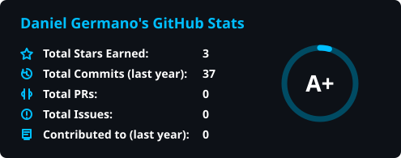

  
  

  

  &nbsp;&nbsp;
  &nbsp;&nbsp;
  &nbsp;&nbsp;
  

## Programming Languages

  
  
  
  

## Tools and Apps

  
  
  
  
  
  
  
  
  

## Projects

  

**Languages**

  
  

**Apps and Tools**

  
  
  
  
  
  
  
  
  

---

  

**Languages**

  
  

**Apps and Tools**

  
  
  
  
  
  
  
  
  

## GitHub Dashboard

  
  

  

