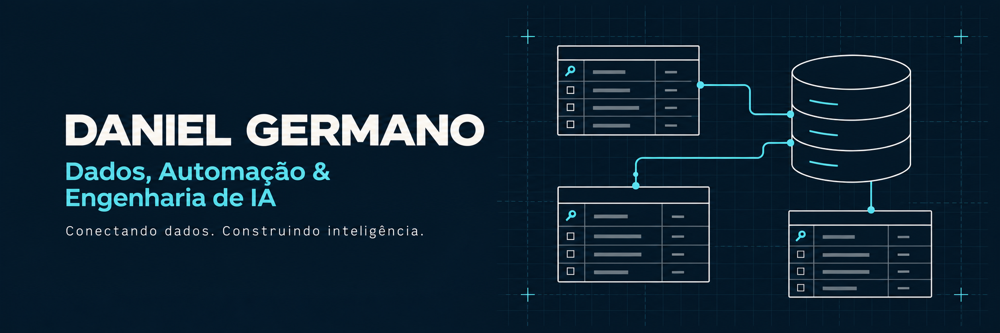
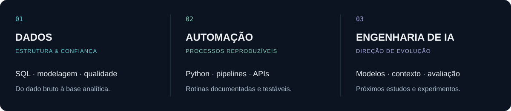

  

  
  
  

### Sobre mim

Sou **Daniel Germano**, estagiário de Engenharia de Dados e estudante de Análise e Desenvolvimento de Sistemas em São Paulo.

Construo **pipelines, automações e APIs com Python e SQL**, com foco em qualidade, rastreabilidade e documentação.

> **IA em evolução:** integração de modelos, RAG e avaliação de respostas.

### Projetos em destaque

**BankGuard** · ETL bancário com validação de transações, Data Warehouse e API REST.

Detalhes técnicos

- ETL em Python com regras de qualidade e trilha de auditoria.
- PostgreSQL com schemas, constraints, índices e Data Warehouse dimensional.
- FastAPI com Swagger e endpoints de clientes, transações, estatísticas e suspeitas.
- Pytest, Ruff, Docker Compose e CI com GitHub Actions.

  
  
  

**RetailFlow Analytics** · Pipeline de varejo nas camadas Bronze, Silver, Gold e Audit, com qualidade de dados e modelagem dimensional.

Detalhes técnicos

- Ingestão e tratamento de seis fontes CSV com Python e Pandas.
- Regras de nulidade, domínio, valores negativos e integridade referencial.
- Dimensões, tabela fato e consultas SQL voltadas a perguntas de negócio.
- DAG do Airflow e modelos dbt já versionados; integração completa permanece no roadmap.

  
  
  

**DataTrace AI** · Compara duas versões de pedidos em CSV e mostra quais registros explicam a mudança no faturamento.

Detalhes técnicos

- Motor em Python com cálculos exatos em centavos e rastreabilidade por pedido e linha.
- Identificação de inclusões, remoções, alterações e repetições, sem modificar os arquivos originais.
- Interface local com upload de CSVs e relatórios em Markdown e JSON.
- 54 testes automatizados, incluindo 300 pares de arquivos gerados para verificar a reconciliação.
- IA opcional: adaptador para priorizar evidências com modelo local; inferência real ainda não validada.

  
  
  

 

  
<strong>Projeto de aprendizagem · Miniguia de Engenharia de Dados</strong>

   
  Conceitos, referências e prompts que registram minha evolução em Engenharia de Dados.
    
  <a href="https://github.com/danielgermano-data/miniguia-engenharia-de-dados">Abrir o miniguia</a>

### Linguagens e ferramentas

  
  &nbsp;&nbsp;
  
  &nbsp;&nbsp;
  
  &nbsp;&nbsp;
  
  &nbsp;&nbsp;
  
  &nbsp;&nbsp;
  
  &nbsp;&nbsp;
  

| Já aplicado em projetos | Em evolução, com escopo identificado |
| --- | --- |
| Python, SQL, PostgreSQL, Pandas | Airflow e dbt |
| ETL/ELT, qualidade e modelagem dimensional | Azure e AWS Fundamentals |
| FastAPI, APIs REST, Pytest e Ruff | Orquestração e observabilidade |
| Docker Compose, Git e GitHub Actions | Arquiteturas de dados em cloud |

### Qualidade e entrega

### Vamos conversar?

Aberto a oportunidades em **Dados, automação e backend Python**.

  
  

  
<strong>English summary</strong>

   
  I am a Data Engineering intern and Systems Analysis student based in São Paulo, Brazil. I build data pipelines and Python backend services using SQL, PostgreSQL, FastAPI and Docker, with an emphasis on data quality, reproducibility and clear technical documentation. My learning direction connects data, automation and AI engineering.

 

