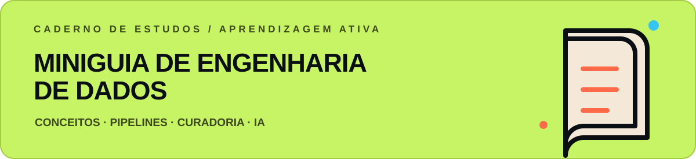
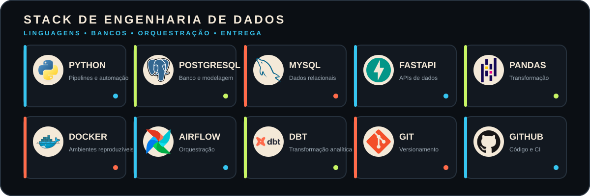

  

   
  
  &nbsp;&nbsp;&nbsp;
  
  &nbsp;&nbsp;&nbsp;
  

## Dados brutos entram. Decisões melhores saem.

Sou **Daniel Germano**, profissional em formação para atuar como **Engenheiro de Dados Júnior**. Desenvolvo projetos que percorrem o caminho completo do dado: ingestão, validação, transformação, modelagem e entrega para análise.

> Meu foco não é apenas fazer o pipeline rodar. É construir dados confiáveis, rastreáveis e úteis para o negócio.

Atualmente, aprofundo meus conhecimentos em **Python, SQL, PostgreSQL, ETL/ELT, Airflow, dbt e Docker**, criando soluções próximas de cenários reais e documentadas para facilitar colaboração, manutenção e evolução.

 

## Projetos em destaque

Pipeline de Engenharia de Dados para varejo e e-commerce, com arquitetura em camadas **Bronze, Silver e Gold**, qualidade de dados, modelagem dimensional e consultas analíticas.

  
  
  
  
  
  
  

 

Plataforma de dados bancários que transforma transações em informação analítica, com **ETL, Data Warehouse, auditoria de qualidade e API REST** documentada com Swagger.

  
  
  
  
  
  
  

 

Curadoria de estudos sobre Engenharia de Dados, pipelines e uso de Inteligência Artificial como ferramenta de aprendizagem ativa.

## Linguagens e ferramentas

  
<strong>Outras ferramentas utilizadas</strong>

   
  Pytest · Ruff · MinIO · GitHub Actions · Swagger · Docker Compose

 

  <strong>Aberto a oportunidades em Engenharia de Dados Júnior</strong>
   
  Vamos transformar dados em decisões.

 

